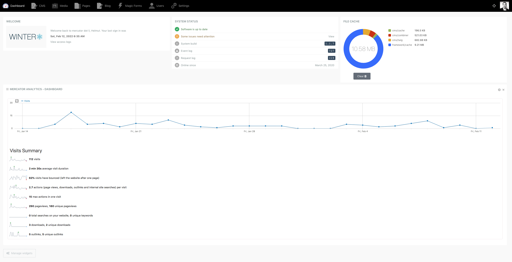

# Matomo Analytics

Matomo Analytics is a [WinterCMS](https://wintercms.com) plugin for
[Matomo](https://matomo.org), a Google Analytics alternative
that lets website owners own their analytical data and protect their
customers' privacy.




## Prerequisites

You must have access to Matomo, either through the cloud services provided by
[Matomo](https://matomo.org) or a
[private Matomo instance](https://matomo.org/matomo-on-premise/). If you are
paranoid about privacy, you might want to go for a private instance.

## Installation

Use Composer to install the plugin by executing

```
composer require mercator/wn-matomo-plugin
```

and running
```
php artisan winter:up
php artisan cache:clear
```

from the root of your [WinterCMS](https://wintercms.com) installation.

Alternatively, create a directory "mercator/matomo", download the
[files from Github](https://github.com/helmutkaufmann/wn-matomo-plugin)
and move them in the newly created sub-directory.

Installation from the [WinterCMS](https://wintercms.com) backend will be
added once the [WinterCMS](https://wintercms.com) marketplace is available.

## Plugin Usage
You must have basic knowledge about Matomo in order to use this plugin,
in particular, you must know how to create new tracking instances,
users and security tokens. Don't be worried. This is quite easy to
learn by playing around with Matomo.
### Configuration
On the Winter backend, go to the settings of the plugin Matomo Analytics.

To get Matomo Analytics running,
- identify the analytics server you intend to use (e.g., matomo.org).
- in the Matoma backend set your CMS server up for tracking and note down the
server ID
- again in the in the Matoma backend generate a security token (so-called "Auth Token")
- enter the above three items in Winter CMS's backend section of the plugin
- goto the CMS section of Winter CMS and drag-drop the tracking code onto the
layout(s) of your Winter site.

With that, Matomo should start tracking and you should see results shortly.
Note that Matomo provides near-realtime results with an emphasis on "near",
so you might have to wait a few minutes to see first results.

### Dashboard Reporting
Goto Winter's Dashbaord and add a new widget. Select *Matomo Widget* as the
widget type in Winter's dashboard when adding a new widget.
Then, select the actual report type. Please see the Matomo backend for a description
(reports are termed very similarly). For each report added, you can change
the reporting period (7/30/360 days) as well as the way the report is
rendered (e.g., a pie chart). It is also possible to export the data of
an individual report.

In addition, the full Matomo Dashboard is available. This is a replica of
the dashboard found in Matomo's backend.
Simply select *Matomo Dashboard* as the widget type when creating the widget in in Winter's dashbaord.

## Thank You
I would like to thank the guys from [WinterCMS](https://wintercms.com) for their
ongoing support - not just for getting this plugin done but also the other ones
I have been writing over the course of the past two years.

Note that this is not about money. It is about appreciation of my time.

## Contributing

Feel free to send pull request! Please, send Pull Request to the master branch.

## A Final Word
This plugin has been compiled by Helmut Kaufmann, Küssnacht am Rigi, in Switzerland.
Helmut can be reached by mail at <software@mercator.li>.

While it might look simple, putting this plugin together took some time.
So, if you find it useful, feel free to sponsor a beer, two or
more are welcome as well. [Paypal](https://www.paypal.com/donate/?hosted_button_id=MZYBN2NEDEDNC) might
be your best friend for this...

## License

Copyright 2022 by Helmut Kaufmann, Küssnacht am Rigi, Switzerland
([https://mercator.li](https://mercator.li)).

This program is free software: you can redistribute it and/or modify it under the
terms of the GNU General Public License as published by the Free Software Foundation,
either version 3 of the License, or (at your option) any later version.</p>

This program is distributed in the hope that it will be useful, but WITHOUT ANY
WARRANTY; without even the implied warranty of MERCHANTABILITY or FITNESS FOR A
PARTICULAR PURPOSE.  See the GNU General Public License for more details. </p>

You should have received a copy of the GNU General Public License along with this program.  
If not, see <a href="https://www.gnu.org/licenses">https://www.gnu.org/licenses.
